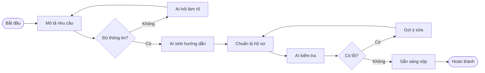

```mermaid

flowchart LR
    A([Bắt đầu])
    B[Mô tả nhu cầu]
    C{Đủ thông tin?}
    D[AI hỏi làm rõ]
    E[AI sinh hướng dẫn]
    F[Chuẩn bị hồ sơ]
    G[AI kiểm tra]
    H{Có lỗi?}
    I[Gợi ý sửa]
    J[Sẵn sàng nộp]
    K([Hoàn thành])

    A --> B --> C
    C -- Không --> D --> B
    C -- Có --> E --> F --> G --> H
    H -- Có --> I --> F
    H -- Không --> J --> K

```
