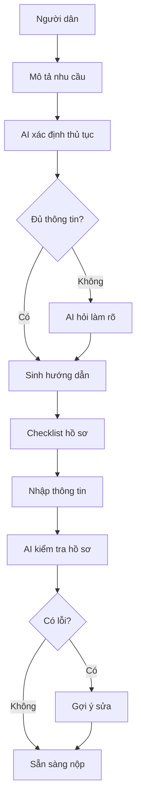

# AI Copilot for Public Services Flowchart

```mermaid
flowchart TD
  A[Người dân] --> B[Mô tả nhu cầu]
  B --> C[AI xác định thủ tục]
  C --> D{Đủ thông tin?}
  D -- Không --> E[AI hỏi làm rõ]
  D -- Có --> F[Sinh hướng dẫn]
  E --> F
  F --> G[Checklist hồ sơ]
  G --> H[Nhập thông tin]
  H --> I[AI kiểm tra hồ sơ]
  I --> J{Có lỗi?}
  J -- Có --> K[Gợi ý sửa]
  J -- Không --> L[Sẵn sàng nộp]
  K --> L
```
