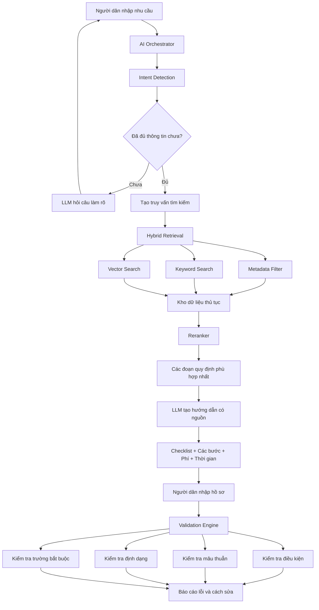

# GovEase AI — Project Description

## 1. Ý tưởng & Vấn đề cốt lõi
- Vấn đề: Người dân khó xác định thủ tục, chuẩn bị hồ sơ và chỉ phát hiện lỗi sau khi nộp, dẫn tới hồ sơ bị trả lại, kéo dài thời gian xử lý và tăng tải cho cơ quan.
- Giải pháp: Một AI Copilot giúp nhận yêu cầu bằng ngôn ngữ tự nhiên, phân loại thủ tục, sinh checklist hồ sơ có cấu trúc và kiểm tra toàn diện trước khi nộp. Kết hợp hai lớp kiểm tra: rule-based (luật xác định) và LLM semantic checks; mọi hướng dẫn phải kèm trích dẫn nguồn chính thức.

## 2. Đối tượng khách hàng & Tác động (Target Audience & Impact)
- Người dân: chuẩn bị đúng hồ sơ ngay lần đầu, giảm lượt đi lại và chi phí, trải nghiệm trực tuyến tốt hơn.
- Cán bộ tiếp nhận: giảm hồ sơ trả lại, giảm thời gian xử lý bổ sung, tập trung vào nhiệm vụ chuyên môn.
- Đơn vị triển khai (Sở, Trung tâm, Cổng): nâng cao chất lượng đầu vào, giảm tải vận hành và dễ triển khai theo module.

## 3. Mô tả giải pháp & Hướng tiếp cận ban đầu
Mục tiêu: xây dựng pipeline demo trong 48 giờ cho 3 thủ tục (đăng ký thường trú, khai sinh, trạng thái công dân), đảm bảo tính grounded và dễ tích hợp.
- Thu thập & ingest dữ liệu:
	- Nguồn: dichvucong.gov.vn, biểu mẫu PDF, hướng dẫn cơ quan.
	- Lưu trữ dưới dạng Markdown/JSON; chunk theo bước logic (một chunk = một giấy tờ / một bước / một giải thích trường), giữ `source_url`, `procedure_id`, `field_id`.
	- Script ingest: crawl/manual → normalize → chunk → metadata tagging → embed.

- Retrieval & Reranking:
	- Hybrid RAG: metadata filter → keyword search → vector search (Chroma) → reranker (metadata boost + simple BM25/TF-IDF).
	- Embedding: `text-embedding-3-small` để build vectors; lưu `source_url` cho mỗi vector.

- Generation & Grounding:
	- LLM (GPT/Gemini) nhận context có chunk trích dẫn, trả về output có cấu trúc (JSON checklist, steps, examples) kèm `sources`.
	- Template prompt bắt buộc: instruction + grounding chunks + expected JSON schema.

- Validation (hai lớp):
	1. Rule-based engine: kiểm tra required fields, format (CCCD, ngày), business rules. Deterministic, có test cases.
	2. LLM semantic checks: cross-field consistency, mâu thuẫn ngữ nghĩa, gợi ý sửa.
	- Output chuẩn: list lỗi {field, error_type, message, suggestion, source_reference}.

- UI & Integration:
	- `FastAPI` backend exposes `/api/intake`, `/api/check` với OpenAPI spec.
	- `React/Next.js` frontend + embeddable widget (iframe/shadow DOM) tiêu thụ JSON và hiển thị checklist/validation.

- Công cụ vận hành & QA:
	- OCR (Tesseract / cloud OCR) cho PDF/ảnh nhập liệu.
	- CI: unit tests cho rule engine, e2e tests cho ingest→RAG→generation→validation.
	- Logging & auditing: trace request → chunks used → source_url, metric cho accuracy/latency.

- Lộ trình 48h (tóm tắt):
	1. Checkpoint 0: chốt scope 3 thủ tục, chuẩn bị dữ liệu mẫu.
	2. Checkpoint 1: ingest + embed + verify retrieval.
	3. Checkpoint 2: guided intake flow + classification.
	4. Checkpoint 3: validation engine (rules + LLM checks).
	5. Checkpoint 4: widget + API + deploy demo.

Ghi chú: Giữ tách biệt rõ ràng giữa luật (deterministic) và LLM (probabilistic); mọi phản hồi cần kèm `source_url` để đảm bảo auditability và compliance.

