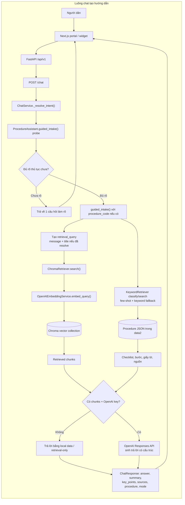

# GovEase AI — Project Description

## 1. Ý tưởng & Vấn đề cốt lõi
- Vấn đề: Người dân khó xác định thủ tục, chuẩn bị hồ sơ và chỉ phát hiện lỗi sau khi nộp, dẫn tới hồ sơ bị trả lại, kéo dài thời gian xử lý và tăng tải cho cơ quan.
- Giải pháp: Một AI Copilot giúp nhận yêu cầu bằng ngôn ngữ tự nhiên, phân loại thủ tục, sinh checklist hồ sơ có cấu trúc và kiểm tra toàn diện trước khi nộp. Kết hợp hai lớp kiểm tra: rule-based (luật xác định) và LLM semantic checks; mọi hướng dẫn phải kèm trích dẫn nguồn chính thức.

## 2. Đối tượng khách hàng & Tác động (Target Audience & Impact)
- Người dân: chuẩn bị đúng hồ sơ ngay lần đầu, giảm lượt đi lại và chi phí, trải nghiệm trực tuyến tốt hơn.
- Cán bộ tiếp nhận: giảm hồ sơ trả lại, giảm thời gian xử lý bổ sung, tập trung vào nhiệm vụ chuyên môn.
- Đơn vị triển khai (Sở, Trung tâm, Cổng): nâng cao chất lượng đầu vào, giảm tải vận hành và dễ triển khai theo module.

## 3. Hướng tiếp cận và giải pháp
**Mục tiêu:** Xây dựng MVP trong 48 giờ cho **2 thủ tục hành chính phổ biến** (đăng ký thường trú, đăng ký khai sinh), đảm bảo hướng dẫn chính xác theo quy định hiện hành, có khả năng kiểm tra hồ sơ trước khi nộp và dễ dàng tích hợp vào Cổng Dịch vụ công.

**1. Thu thập và xây dựng kho tri thức**
- Nguồn dữ liệu: **Cổng Dịch vụ công Quốc gia**, biểu mẫu hành chính, văn bản hướng dẫn và PDF chính thức.
- Chuẩn hóa dữ liệu dưới dạng **Markdown/JSON**.
- Chia dữ liệu theo **logic nghiệp vụ** (mỗi chunk tương ứng với một giấy tờ, một bước thực hiện hoặc một trường biểu mẫu), đồng thời lưu metadata gồm **procedure_id**, **field_id** và **source_url**.
- Thực hiện pipeline **ingest → preprocessing → chunking → embedding → lưu trữ trên Chroma Vector Database**.

**2. Truy xuất tri thức (Hybrid RAG)**
Áp dụng **Hybrid Retrieval** để tăng độ chính xác:
- Lọc theo metadata của thủ tục.
- Keyword search.
- Vector search trên Chroma bằng **text-embedding-3-small**.
- Reranking dựa trên metadata và mức độ liên quan.
- Mỗi kết quả truy xuất đều giữ **source_url** để đảm bảo khả năng kiểm chứng.

**3. Sinh hướng dẫn bằng AI (Grounded Generation)**
- Người dùng mô tả nhu cầu bằng ngôn ngữ tự nhiên.
- LLM xác định thủ tục phù hợp, chỉ hỏi tối đa **một câu** mỗi lần nếu thông tin chưa rõ.
- AI hướng dẫn từng bước làm thủ tục theo **định dạng JSON có cấu trúc**.
- Mọi phản hồi đều dựa trên dữ liệu RAG và kèm **trích dẫn nguồn chính thức**.

**5. Tích hợp và triển khai**
- **Backend:** FastAPI, cung cấp API `/api/v1/chat`.
- **Frontend:** React/Next.js hiển thị checklist và kết quả kiểm tra dưới dạng trực quan.
- Hỗ trợ triển khai dưới dạng **website độc lập**, **chatbot** hoặc **widget nhúng** (iframe/shadow DOM) để tích hợp trực tiếp vào Cổng Dịch vụ công mà không cần thay đổi hạ tầng hiện có.

**6. Kiểm thử và đánh giá**
- Xây dựng bộ test cho **Rule Engine** và kiểm thử toàn bộ pipeline **ingest → retrieval → generation → validation**.
- Ghi nhận log của từng yêu cầu, các chunk được truy xuất và nguồn dữ liệu sử dụng nhằm đảm bảo **auditability**, **traceability** và khả năng đối chiếu với quy định hiện hành.
- Theo dõi các chỉ số như **độ chính xác truy xuất**, **tỷ lệ phát hiện lỗi**, **độ trễ phản hồi** và **tính đầy đủ của hướng dẫn**.

rd

