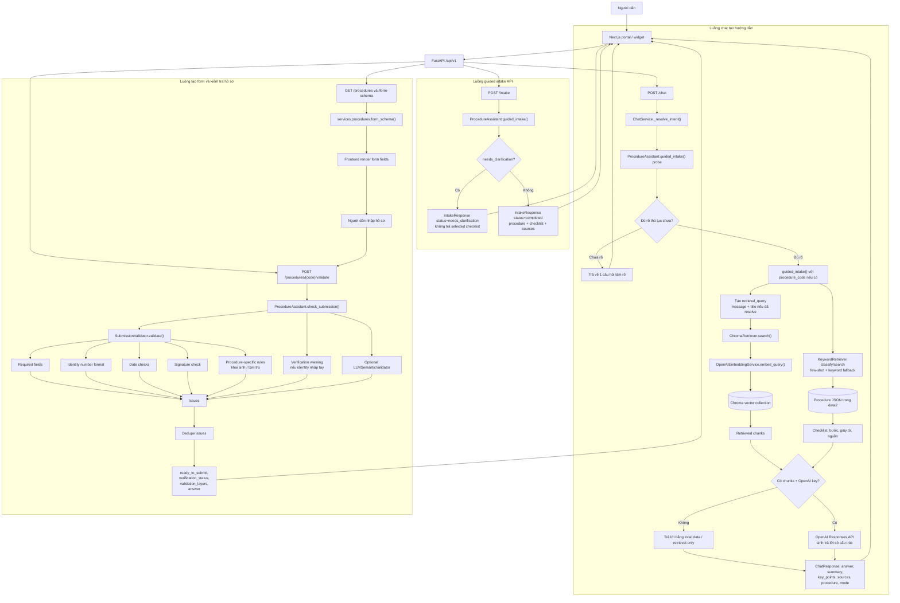

# GovEase-AI Code Flowchart

Sơ đồ này mô tả luồng hoạt động đúng theo code hiện tại. Nó tách rõ luồng hội thoại/hướng dẫn và luồng kiểm tra hồ sơ.

Các điểm cố ý không vẽ như module riêng:

- Không có stage `Reranker` riêng trong code hiện tại.
- Không có stage `Metadata Filter` runtime riêng trong code hiện tại.
- `AI Orchestrator` trong flow cũ được thay bằng các hàm/thành phần thật: `ChatService`, `ProcedureAssistant`, `ChromaRetriever`, `SubmissionValidator`.
